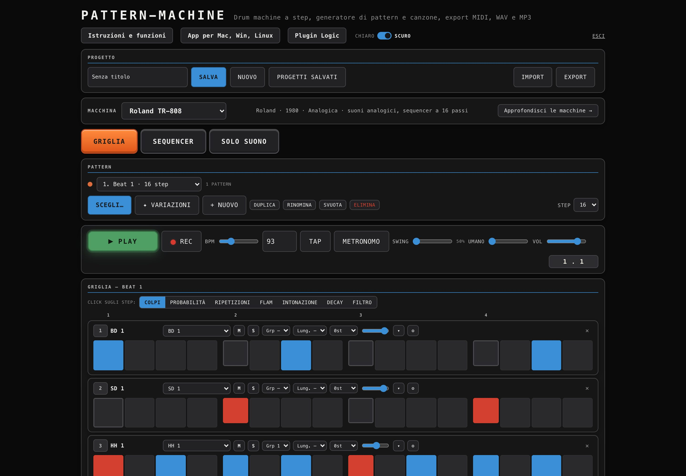
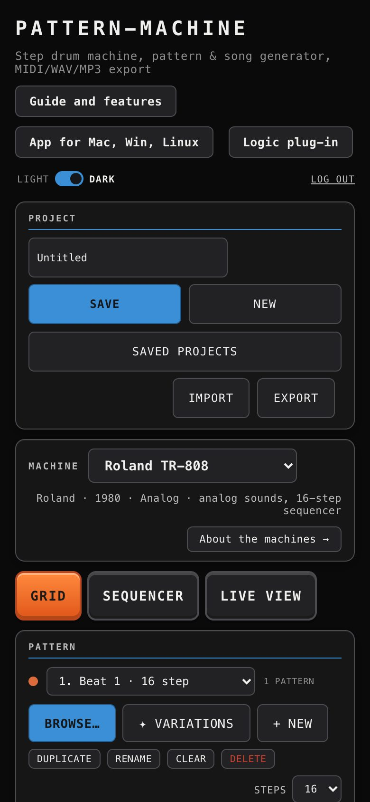
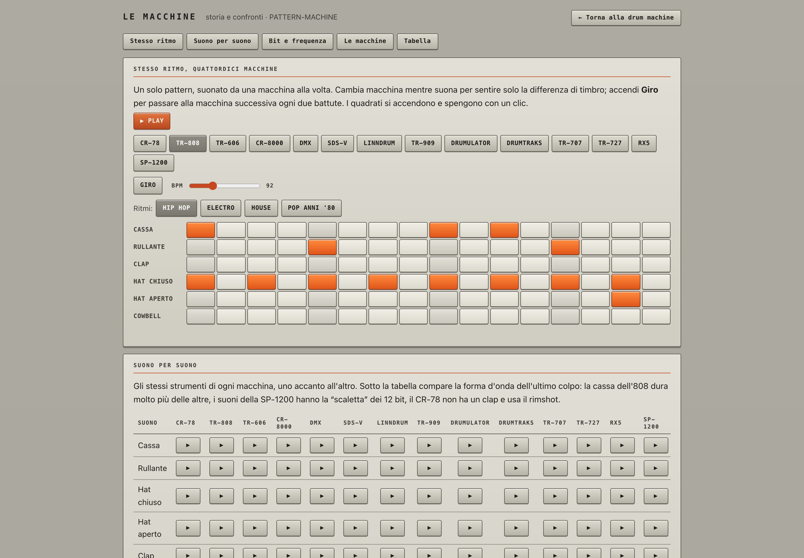
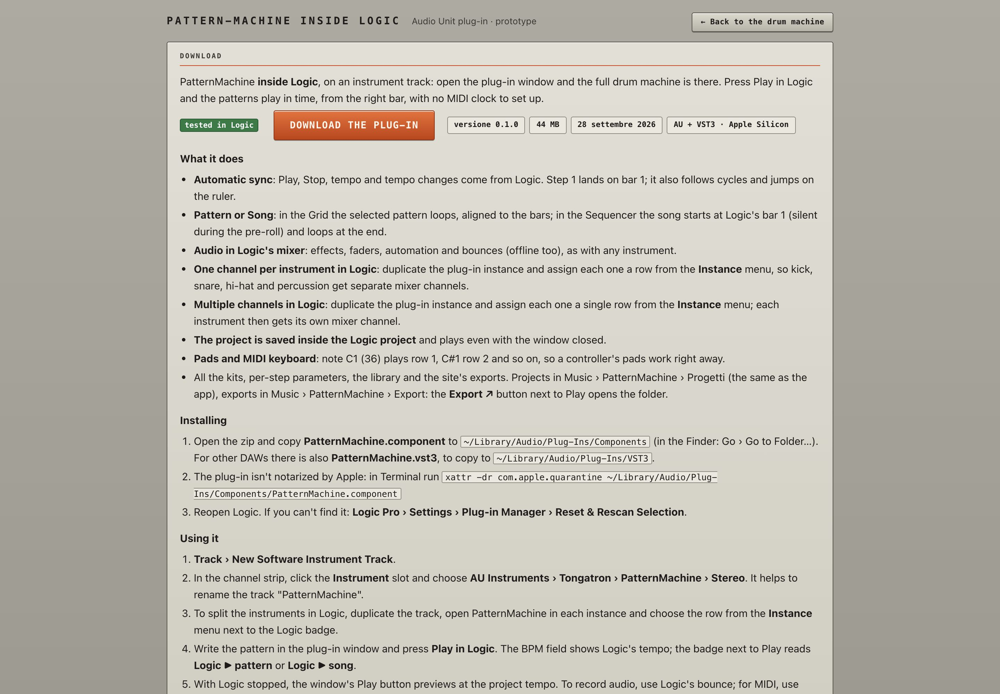

# PATTERN-MACHINE

**PatternMachine is a rhythm-focused software groovebox built around classic drum machines, synth patterns and song arranging.**
Runs in the browser, as a desktop app for macOS, Windows and Linux, and as a plug-in inside Logic Pro.

**Website:** [patternmachine.tongatron.org](https://patternmachine.tongatron.org) ·
[Desktop app](https://patternmachine.tongatron.org/app.html) ·
[Logic plug-in](https://patternmachine.tongatron.org/plugin.html) ·
[Guide](https://patternmachine.tongatron.org/funzioni.html) ·
[The machines](https://patternmachine.tongatron.org/macchine.html)


## Contents

- [Overview](#overview)
- [Features](#features)
- [Desktop app](#desktop-app-macos-windows-linux)
- [Logic Pro plug-in](#logic-pro-plug-in-au--vst3)
- [MIDI and DAW integration](#midi-and-daw-integration)
- [Screenshots](#screenshots)
- [Repository layout](#repository-layout)
- [Credits](#credits)

## Overview

PATTERN-MACHINE is a step drum machine styled after the front panel of the **E-mu SP-1200**. Pick a machine, generate a
beat in the style you want, edit it step by step, chain patterns into a song and take it to your DAW as MIDI, WAV, MP3
or a ready-made project folder.

It comes in three forms that share the same interface:

| | Runs on | Adds |
|---|---|---|
| 🌐 **Website / PWA** | any modern browser, including phones | nothing to install; can be installed as a web app |
| 🖥️ **Desktop app** | macOS, Windows, Linux | virtual MIDI port, sync to the DAW's MIDI Clock, drag-and-drop into the DAW timeline, projects as files, offline use, custom sample kits |
| 🎛️ **Logic plug-in** | Logic Pro (AU) and other hosts (VST3) | plays inside an instrument track, sample-accurate with the host transport, state saved with the Logic project |

## Features

### Classic machines
E-mu **SP-1200** (16-bit and the original **12-bit** samples), Yamaha **RX-5**, Roland **TR-808**, **TR-909**, **TR-707**,
**TR-727**, **TR-606**, **CR-78**, **CR-8000**, Linn **LinnDrum**, Oberheim **DMX**, E-mu **Drumulator**, Sequential
**DrumTraks** and Simmons **SDS-V**.
Switching machine maps every row to the closest sound. Each machine shows its maker, year and specs, and the
[machines page](https://patternmachine.tongatron.org/macchine.html) covers the history of each one with photos and Wikipedia links.

### Pattern generator
- **67 styles** in 10 families: punk, post-punk, classic drum machines, alternative, hip hop / dance / latin, reggae / dub, breakbeat / DnB, soul / disco / afro, heavy rock / metal, electronic / club.
- One-click **variations**, automatic **fills** and a library that suggests 8 patterns whenever you change style.
- Import patterns from text (PatternTXT format) or MIDI.

### Step grid
- 8, 16 or 32 steps, 40–240 BPM, **swing**, **humanize**, per-track nudge, polyrhythms, choke groups.
- Every hit can be normal, **accent** or **ghost note**.
- Per-step **probability**, **ratchets**, **flam**, **pitch**, **decay** and **filter**.
- Live **recording** from the pads or the keyboard (`1 2 3 4 · Q W E R · A S D F · Z X C V`), 80 levels of undo.
- **Metronome** that also runs with the transport stopped, so you can play along to a click without a beat.

### Song mode
Chain patterns into blocks (verse, chorus, fill…), each with its own repeats. Drag blocks to reorder them, start playback
from any point on the timeline or solo a single block.

### Export
| Format | What you get |
|---|---|
| **MIDI** (pattern or song) | General MIDI (36 kick, 38 snare, 42/46 hi-hats) or the Logic SP-1200 kit mapping; tempo, swing and ratchets included |
| **WAV** and **stems** | full mix and separate tracks, aligned to bar 1 |
| **MP3** | for listening and sharing, works in every browser |
| **DAW package** | a folder ready for Logic Pro, Ableton Live, REAPER and other DAWs |
| **Project / link** | project JSON and a shareable link |

## Desktop app (macOS, Windows, Linux)

Download it from the [app page](https://patternmachine.tongatron.org/app.html) (requires a site account).

| In the browser | In the app |
|---|---|
| Export a zip, unzip it, import it into the DAW | **Drag** `⠿ MIDI` or `⠿ WAV` straight onto the DAW timeline |
| No live MIDI output | **Virtual MIDI port "PatternMachine"**: patterns play Drum Kit Designer, Drum Machine Designer or any instrument, and pad hits can be recorded in the DAW |
| Play and tempo set by hand | **Follows the DAW's MIDI Clock**: play, stop, continue, cycles and tempo |
| Projects synced with your account (on the server, the same in every browser) | Projects as **files** in `~/Music/PatternMachine/Projects`, synced with the same account after signing in; exports in `~/Music/PatternMachine/Export` |
| Needs a network connection | Works fully offline, with **all** the sounds |

You can also **import your own drum machines** from a folder or zip of samples (WAV, AIFF, MP3, OGG, FLAC, M4A).

| Platform | Build | Status |
|---|---|---|
| macOS | Apple Silicon, macOS 12+ | tested |
| Windows | x64 installer | untested |
| Linux | x64 AppImage | untested |

The builds are not signed with a commercial certificate, so the first launch needs the usual confirmation
(right-click › Open on macOS, "More info › Run anyway" on Windows, `chmod +x` on Linux).

## Logic Pro plug-in (AU / VST3)

PATTERN-MACHINE on a Logic instrument track: press Play in Logic and the patterns play in time from the right bar, with no
MIDI clock to set up.

- Sample-accurate sync with Logic's transport, tempo changes, cycles and jumps.
- Audio goes through the Logic channel strip, so effects, mixer and automation work, as do real-time and offline bounces.
- The project is saved **inside the Logic project** and plays even with the plug-in window closed.
- Incoming MIDI notes on the track trigger the rows (C1 = row 1, as on MPK pads).
- **Several instances, one row each**: duplicate the track and pick a single row (BD, SD, HH…) per instance to get each drum on its own mixer channel.

Download it from the [plug-in page](https://patternmachine.tongatron.org/plugin.html). To add it in Logic: new **Software
Instrument** track › Instrument slot › **AU Instruments › Tongatron › PatternMachine**.

## MIDI and DAW integration

The desktop app's **PatternMachine** virtual port works with Logic Pro, Ableton Live, REAPER, FL Studio, Cubase, Bitwig,
Studio One and any DAW that sees system MIDI ports.

| To… | Use |
|---|---|
| play the DAW's drum instruments | app › **MIDI output** (channel 10, or one channel per row) |
| follow the DAW's tempo and transport | DAW › send **MIDI Clock** (+ Start/Stop, Song Position) to *PatternMachine*, app › **Follow DAW clock** |
| play inside a track, sample-accurate | the **AU / VST3 plug-in** |
| work offline | export **General MIDI**, **WAV** or **stems** |

Quick settings for the most common DAWs:

| DAW | Setting |
|---|---|
| Logic Pro | Project Settings › Synchronization › MIDI: send MIDI Clock to *PatternMachine* |
| Ableton Live | Preferences › Link/Tempo/MIDI: enable **Sync** on the *PatternMachine* output |
| REAPER | enable *PatternMachine* as a MIDI device and select it as the MIDI Clock output |
| Cubase | Project Synchronization Setup › MIDI Clock destinations: enable *PatternMachine* |
| FL Studio | MIDI settings: enable the *PatternMachine* output and send master sync |
| Bitwig / Studio One | enable *PatternMachine* as a MIDI Clock and Start/Stop destination |

Step-by-step instructions are in the [guide](https://patternmachine.tongatron.org/funzioni.html).

## Screenshots

| Song arranger | Dark theme |
|---|---|
|  |  |



| The machines | Desktop app downloads |
|---|---|
|  |  |



## Repository layout

| Path | Contents |
|---|---|
| [`site/`](site) | the website: drum machine, pattern engine, guide, machines page, PWA, samples |
| [`desktop/`](desktop) | desktop app for macOS, Windows and Linux ([notes](desktop/README.md)) |
| [`plugin/`](plugin) | Logic Pro plug-in, AU / VST3 ([notes](plugin/README.md)) |
| [`SP 1200/`](<SP 1200>) | original SP-1200 samples and pad mappings |
| [`legacy/`](legacy) | early standalone pages: the first toolkit and the single-file SP-1200 |
| `tests/` | engine and site checks |

To try the site locally, serve the `site` folder with any static server:

```bash
python3 -m http.server 8765 --directory site
```
