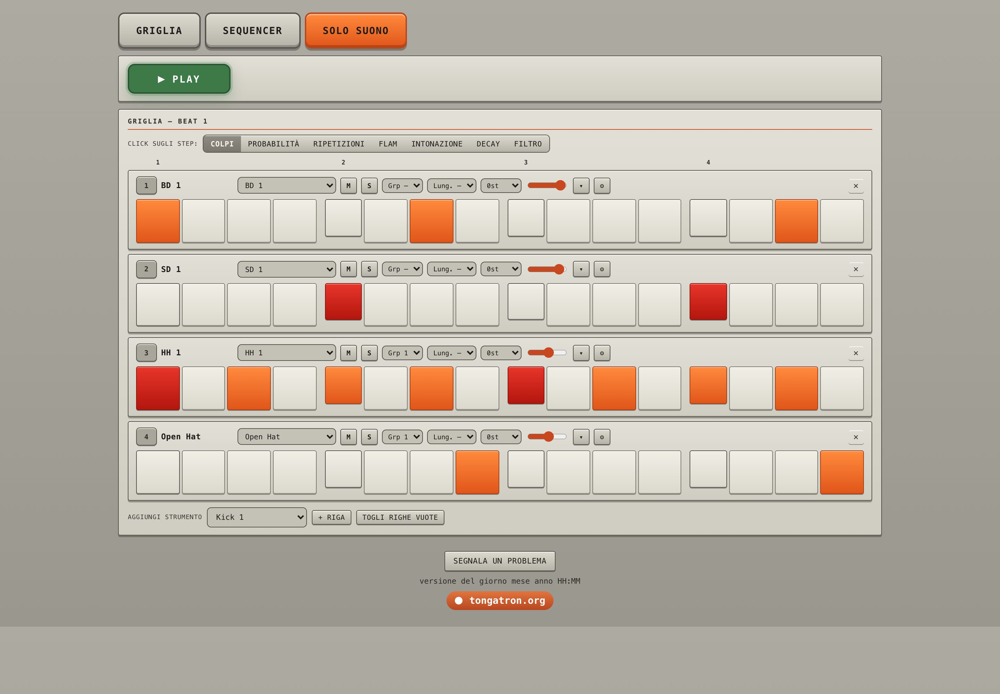

<div align="center">

# P A T T E R N — M A C H I N E

**Drum machine a step con le macchine storiche, generatore di pattern e canzoni, export per ogni DAW.**
Nel browser, come app per macOS / Windows / Linux e come plug-in dentro Logic Pro.

[**▶ Apri il sito**](https://patternmachine.tongatron.org) ·
[App desktop](https://patternmachine.tongatron.org/app.html) ·
[Plug-in Logic](https://patternmachine.tongatron.org/plugin.html) ·
[Istruzioni](https://patternmachine.tongatron.org/funzioni.html) ·
[Le macchine](https://patternmachine.tongatron.org/macchine.html)


</div>

---

## Cos'è

PATTERN-MACHINE è una drum machine a step ispirata al pannello della **E-mu SP-1200**. Scegli una macchina, fai generare un
ritmo nello stile che vuoi, modificalo step per step, mettilo in fila in una canzone e portalo nella tua DAW come MIDI, WAV,
MP3 o pacchetto pronto per Logic, Ableton Live o REAPER.

Esiste in tre forme, con la stessa interfaccia:

| | Dove gira | Cosa aggiunge |
|---|---|---|
| 🌐 **Sito / PWA** | qualsiasi browser, anche su telefono | nessuna installazione, si installa come web app |
| 🖥️ **App desktop** | macOS, Windows, Linux (Electron) | porta MIDI virtuale, sync al MIDI Clock della DAW, drag & drop di MIDI/WAV nella timeline, progetti su file, offline |
| 🎛️ **Plug-in Logic** | Logic Pro (AU) e altre DAW (VST3) | suona dentro la traccia, a tempo e al campione con il trasporto della DAW, stato salvato nel progetto |

## Funzioni

### 🥁 Macchine storiche
E-mu **SP-1200** (16 bit e **12 bit** originali), Yamaha **RX-5**, Roland **TR-808**, **TR-909**, **TR-707**, **TR-727**,
**TR-606**, **CR-78**, **CR-8000**, Linn **LinnDrum**, Oberheim **DMX**, E-mu **Drumulator**, Sequential **DrumTraks**,
Simmons **SDS-V**. Cambiando macchina ogni riga passa al suono equivalente. Accanto al selettore ci sono anno, costruttore e dati
tecnici, e la pagina [Le macchine](https://patternmachine.tongatron.org/macchine.html) racconta la storia di ognuna con foto e link a Wikipedia.

### 🧠 Generatore di pattern
- **67 stili** in dieci famiglie: punk, post-punk, drum machine classiche, alternative, hip hop / dance / latin, reggae / dub, breakbeat / DnB, soul / disco / afro, rock pesante / metal, elettronica / club.
- **Variazioni** di un pattern con un click, **fill** automatici e una libreria che propone 8 pattern a ogni cambio di stile.
- Import di pattern da testo ([PatternTXT](PATTERNTXT-SPEC.md)) e da MIDI.

### 🎚️ Griglia e step
- 8, 16 o 32 step, BPM 40–240, **swing**, **umanizza**, nudge per traccia, poliritmi, gruppi choke.
- Ogni colpo può essere normale, **accento** o **nota fantasma**.
- Per singolo step: **probabilità**, **ripetizioni** (ratchet), **flam**, **intonazione**, **decay** e **filtro**.
- **Rec** dal vivo con i pad o la tastiera (`1 2 3 4 · Q W E R · A S D F · Z X C V`), annulla / ripristina fino a 80 passi.
- **Metronomo** attivabile anche a trasporto fermo, per suonare sopra al click senza una base.

### 🎼 Canzone
Il sequencer mette in fila i pattern come blocchi (strofa, ritornello, fill…), ognuno con le sue ripetizioni. Si trascinano per
riordinarli, si parte da un punto qualsiasi della timeline e si può mettere un blocco in solo.

### 🔈 Vista "Solo suono"
Solo la griglia dei beat e Play / Stop, senza il resto dell'interfaccia. Pensata per suonare, provare e registrare.

<p align="center"> </p>

### 📦 Export
| Formato | Contenuto |
|---|---|
| **MIDI** pattern / canzone | General MIDI (36 cassa, 38 rullante, 42/46 hi-hat) oppure mappa del kit SP-1200 di Logic; include tempo, swing e ripetizioni |
| **WAV** e **stem** | mix e tracce separate, già allineate alla battuta 1 |
| **MP3** | per ascoltare e condividere, in ogni browser |
| **Pacchetto DAW** | cartella pronta per Logic Pro, Ableton Live, REAPER e altre DAW |
| **Progetto / link** | JSON del progetto e link condivisibile |

### 🌗 Tema chiaro e scuro, telefono e desktop
<p align="center"> </p>

---

## 🖥️ App per macOS, Windows e Linux

Scaricabile dalla pagina [App per Mac, Win, Linux](https://patternmachine.tongatron.org/app.html) (dietro l'accesso al sito).

| Nel browser | Nell'app |
|---|---|
| Esporti uno zip e lo importi nella DAW | **Trascini** `⠿ MIDI` o `⠿ WAV` direttamente nella timeline |
| Niente MIDI dal vivo | **Porta MIDI virtuale "PatternMachine"**: i pattern suonano Drum Kit Designer, Drum Machine Designer o qualsiasi strumento; i pad si registrano nella DAW |
| Play e BPM a mano | **Segue il MIDI Clock della DAW**: Play, Stop, Continua, cicli e tempo |
| Progetti nel browser | Progetti come **file** in `~/Music/PatternMachine/Progetti`, export in `~/Music/PatternMachine/Export` |
| Serve la rete | Tutto in locale, anche offline, con **tutti** i suoni (anche i kit estratti da Logic) |

Si possono anche **importare drum machine proprie** da una cartella o da uno zip di campioni (WAV, AIFF, MP3, OGG, FLAC, M4A).

<p align="center"></p>

## 🎛️ Plug-in per Logic Pro (AU / VST3)

PATTERN-MACHINE dentro Logic, su una traccia strumento: si preme Play in Logic e i pattern suonano a tempo, dalla battuta
giusta, senza clock MIDI da configurare. Motore in C++ (JUCE 8) sincronizzato al campione con il PPQ della DAW, interfaccia
web nel plug-in, stato salvato nel progetto di Logic, bounce offline, note MIDI in ingresso sui pad e **più istanze con una
riga ciascuna** per avere cassa, rullante e hi-hat su canali separati del mixer.

Dettagli e build: [`plugin/README.md`](plugin/README.md).

<p align="center"></p>

## 🎹 MIDI e DAW

La porta virtuale **PatternMachine** dell'app funziona con Logic Pro, Ableton Live, REAPER, FL Studio, Cubase, Bitwig,
Studio One e con le altre DAW che gestiscono le porte MIDI del sistema.

| Per… | Usa |
|---|---|
| suonare gli strumenti della DAW | app → **Uscita MIDI** (canale 10 o un canale per riga) |
| seguire tempo e trasporto della DAW | DAW → invio **MIDI Clock** (+ Start/Stop, Song Position) verso *PatternMachine*, app → **Segui il clock della DAW** |
| suonare dentro la traccia, al campione | **plug-in** AU / VST3 |
| lavorare offline | export **MIDI General MIDI**, **WAV** o **stem** |

Le impostazioni passo per passo per ogni DAW sono nella pagina [Istruzioni](https://patternmachine.tongatron.org/funzioni.html).

<p align="center"></p>

---

## Per sviluppatori

### Struttura

| Percorso | Cosa contiene |
|---|---|
| `site/` | il sito: `index.html`, motore ritmico in `site/engine/` (core, variazioni e arrangiamento, schede degli stili), PWA (`sw.js`, `manifest.json`, `icons/`), campioni (`samples`, `samples12`) e macchine in `machines/` |
| `desktop/` | app Electron per macOS, Windows e Linux ([README](desktop/README.md)) |
| `plugin/` | plug-in AU / VST3 in JUCE 8 ([README](plugin/README.md)) |
| `server.py` | server statico + API (account, pattern) |
| `scripts/` | deploy ed estrazione dei kit da Logic |
| `tests/` | test del motore, del sito e del server |
| `SP 1200/` | campioni originali, remap dei pad MPK |
| `PATTERNTXT-SPEC.md` | formato testuale dei pattern |
| `TODO.md` | idee e lavori rimandati |

In origine il progetto si chiamava Drum Machine Lab (drummachine.tongatron.org): quell'indirizzo ora trasferisce i dati salvati nel browser e rimanda al nuovo.

### Macchine (kit di campioni)

Una macchina è una cartella di WAV in `site/machines/<id>/` più una tabella in `site/index.html` (`*_SLOTS`, che deve coprire
gli slot del generatore: lo verifica `tests/site_test.py`). Tutti i kit tranne **SP-1200 e RX-5** vengono da Logic Pro (kit
"Boutique" e kit del Sampler, ricreazioni di Apple): si estraggono con `scripts/extract-logic-kits.sh`, non stanno in git e
`deploy.sh` li pubblica solo con `--con-kit-logic`. Un kit i cui file il server non serve sparisce dal selettore.

| Cartella | Macchina | Da Logic Pro |
|---|---|---|
| `samples`, `samples12` | SP-1200 16 bit / 12 bit | — (campioni originali, in git) |
| `rx5` | Yamaha RX-5 | — (campioni RX-5, in git) |
| `tr808`, `tr909`, `cr78` | TR-808, TR-909, CR-78 | Ultrabeat "Boutique 808/909/78" |
| `sp12b` | SP-1200 · Boutique | Ultrabeat "Boutique SP12" |
| `dmx`, `drumulator` | Oberheim DMX, E-mu Drumulator | Ultrabeat "Vintage Machines" (DMX senza clap/rim, Drumulator senza hi-hat) |
| `linn` | LinnDrum | Sampler "Cory's LinnDrum Kit" |
| `tr707`, `tr727`, `tr606`, `cr8000`, `drumtraks`, `sdsv` | TR-707, TR-727, TR-606, CR-8000, DrumTraks, Simmons SDS-V | Sampler, kit "… Processed" (la 727 ha solo percussioni latine) |
| `tr808u`, `tr909u` | TR-808 / TR-909 · campioni | Sampler, kit "… Unprocessed" |

Per aggiungere un kit: una riga in `scripts/extract-logic-kits.sh`, la tabella `*_SLOTS` in `site/index.html`, l'id in
`KIT_MENU_FIRST` (altrimenti finisce in fondo al menu), la cartella in `.gitignore` e in `LOGIC_KITS` di `scripts/deploy.sh`;
la scheda storica (facoltativa) va in `site/macchine.html`.

### Test

```bash
node tests/engine.test.js
```

```bash
python3 tests/site_test.py
```

```bash
python3 tests/server_test.py
```

### Pubblicazione

```bash
scripts/deploy.sh
```

```bash
scripts/deploy.sh --yes
```

Il primo comando è una prova a secco, il secondo pubblica (con backup sul server).
Quando cambiano `site/sw.js` o `site/engine/*.js` va aumentata la versione in tre punti che lo script controlla: `VERSION`
in `sw.js`, `SW_VERSION` e i `?v=` degli script del motore in `site/index.html`. Se cambia `server.py` va riavviato il
servizio `patternmachine` sul server.

### Account

Ognuno entra con il proprio nome e la propria password.
- Dal sito ci si registra come **utente** (nome, email obbligatoria, password). Arriva una mail di benvenuto e si può chiedere un link per una nuova password (vale un'ora, si usa una volta).
- L'**admin** si crea sul server con `python3 add-user.py <nome> --admin` (lo stesso script cambia password e ruolo). La pagina `/admin` elenca gli utenti, manda link di reset ed elimina account.
- Utenti in `data/users.json`, mail via Gmail con `mail.json` (`python3 set-mail.py`): stanno solo sul server e non vengono mai serviti.

---

<div align="center">

Fatto da [tongatron.org](https://tongatron.org) · i kit ricavati da Logic Pro sono ricreazioni di Apple, non campioni originali dei costruttori.

</div>
