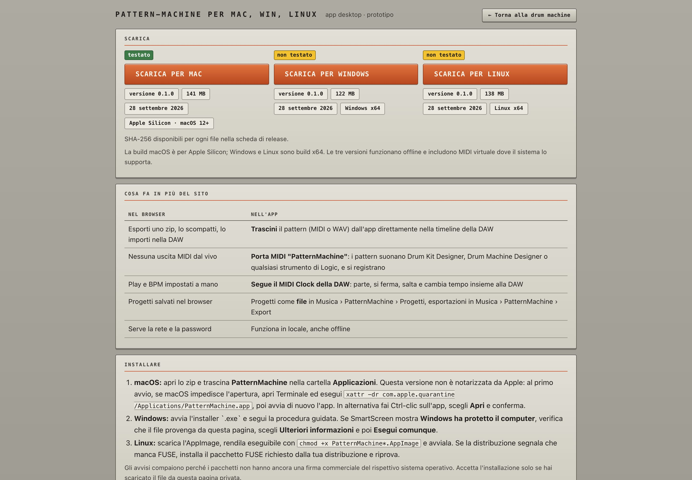
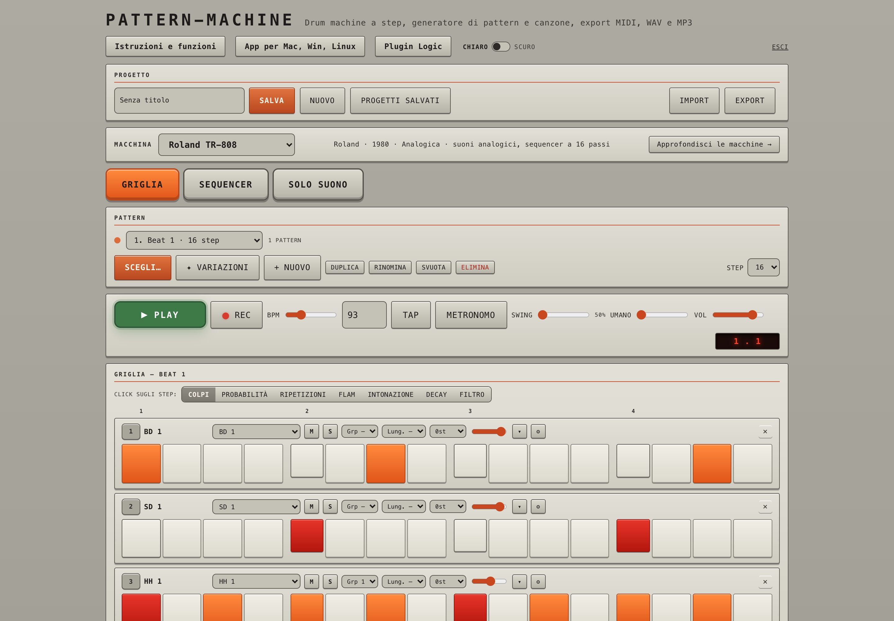
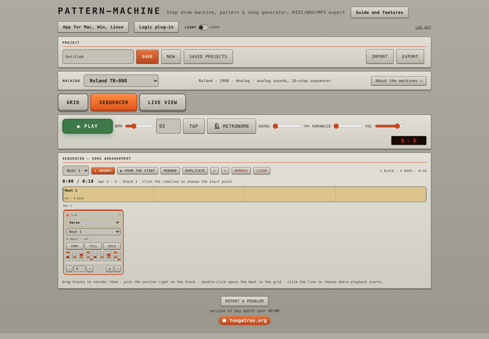

# PatternMachine Desktop — il tuo groove, direttamente nella DAW

PatternMachine è una drum machine creativa per producer e musicisti: genera idee, scolpisci ogni colpo e porta il
risultato in Logic Pro o nella tua DAW senza passaggi inutili.

L'app desktop trasforma PatternMachine in uno strumento da studio: audio interno, MIDI live, sincronizzazione al
trasporto della DAW, drag and drop e progetti locali in un'unica finestra.



## In evidenza

- **Drag and drop nella DAW** — trascina MIDI o WAV direttamente nella timeline.
- **MIDI live** — la porta virtuale `PatternMachine` pilota Drum Kit Designer, Drum Machine Designer e qualsiasi
  strumento MIDI.
- **Clock della DAW** — Play, Stop, ciclo, posizione e BPM restano agganciati a Logic, Ableton Live, REAPER e alle
  altre DAW compatibili.
- **Workflow offline** — i suoni sono inclusi e i progetti vengono salvati come file nella cartella Musica.
- **Kit personalizzati** — importa una tua drum machine da una cartella o da uno ZIP.
- **Export pronto per lo studio** — MIDI, WAV, stem, MP3 e pacchetti organizzati per Logic, Ableton e REAPER.



> Dall'idea al beat in pochi secondi: genera un pattern, applica una variazione, rifinisci il feeling e trascinalo
> nella sessione.

## Perché un'app: cosa si guadagna rispetto al browser

| Nel browser | Nell'app |
|---|---|
| Esporti uno zip, lo scarichi, lo scompatti, lo importi in Logic | **Trascini** `⠿ MIDI` o `⠿ WAV` dal pannello Logic direttamente nella timeline di Logic |
| Nessuna uscita MIDI dal vivo (Web MIDI c'è solo su Chrome, Safari non lo supporta) | **Porta MIDI virtuale "PatternMachine"**: Logic la vede come una tastiera, i pattern suonano Drum Kit Designer, Drum Machine Designer o qualsiasi strumento. I colpi suonati sui pad (tasti 1-4, Q-R…) si registrano in Logic |
| Play e BPM da impostare a mano | **Segue il MIDI Clock di Logic**: Play/Stop/Continua di Logic comandano l'app, la posizione del playhead (anche nei cicli) e il tempo arrivano da Logic, e ogni sedicesimo scatta al clock, quindi l'app non va fuori tempo |
| Progetti nel `localStorage` del browser, legati al dominio (li ha messi a rischio il trasloco drummachine → patternmachine) | Progetti come **file JSON** in `~/Music/PatternMachine/Projects` (fino alla 0.2 `Progetti`, rinominata da sola al primo avvio): si copiano, si mettono in Time Machine o iCloud, si rimuovono nel Cestino. Con l'accesso all'account (scheda *Saved projects* › *Sign in*) la cartella si **sincronizza** con i progetti del sito e degli altri computer |
| "Logic (zip)" finisce in Download | **"Logic (folder)"**: cartella già scompattata in `~/Music/PatternMachine/Export`; anche MIDI e WAV vanno lì, e il pulsante "Show last export" la apre nel Finder |
| Serve il server, la password e la rete | Tutto in locale, anche offline; il login serve solo a sincronizzare i progetti |
| Scorciatoie in conflitto con quelle del browser, tab e barre | Finestra propria, menu macOS (File › Open Projects Folder / Open Export Folder) |

L'audio interno è lo stesso motore Web Audio del sito. Con "Internal sound" spento si sentono solo
gli strumenti di Logic pilotati dal MIDI.



## Usarla

```bash
cd desktop
npm install
npm start               # avvia l'app dai sorgenti (usa ../site così com'è)
npm run dist            # crea dist/mac-arm64/PatternMachine.app (non firmata)
```

L'app non è firmata: la prima volta si apre con tasto destro › Apri.
È un progetto personale: ogni build include tutti i suoni del sito, cioè i campioni SP-1200 e RX-5 e tutti i kit delle macchine in `site/machines`, anche quelli che non vanno sul sito web. Prima di una build i kit devono essere presenti in quella cartella.

## Pubblicarla sul sito (pagina "App per Mac")

```bash
desktop/scripts/release.sh     # build macOS, Windows e Linux con tutti i suoni (si ferma se ne manca uno), firma ad-hoc, zip + app.json in site/download/
scripts/deploy.sh --yes        # pubblica sito e download (come sempre)
```

La pagina `site/app.html` legge `download/app.json` (versione, dimensione, SHA-256) e punta allo zip con `?v=<impronta>`,
così una versione nuova non arriva mai dalla cache. `site/download/` non va in git.
Il download sta dietro la password del sito come tutto il resto e passa dal tunnel Cloudflare senza essere messo in cache
(`Cache-Control: private`): Cloudflare non ha limiti di dimensione sulle risposte (il limite di 100 MB vale solo per gli upload).
Per aggiornare l'app: alza `version` in `package.json`, rilancia i due comandi.

L'app controlla anche il messaggio opzionale `GET /api/app-message` e lo mostra una sola volta. Sul server si attiva creando `/srv/apps/patternmachine/data/app-message.json`, per esempio:

```json
{
  "id": "download-2026-09-27",
  "title": "Nuova versione disponibile",
  "message": "Puoi scaricare la nuova versione di PatternMachine.",
  "url": "https://patternmachine.tongatron.org/app.html",
  "expires": "2026-10-31T23:59:59Z"
}
```

## Collegarla a Logic

**Note da PatternMachine a Logic (uscita MIDI)**
1. Nel pannello Logic dell'app lascia attiva **MIDI output**. Con **Notes: General MIDI** le note sono quelle di Drum Kit Designer e Drum Machine Designer (36 cassa, 38 rullante, 42 hat chiuso…). **Kit SP-1200 (36+)** è per il kit SP-1200 creato in Logic.
2. In Logic crea una traccia strumento (per esempio Drum Machine Designer) e mettila in registrazione o in monitor: in Logic il MIDI in ingresso arriva da tutte le porte, compresa "PatternMachine".
3. Premi Play nell'app, oppure fai partire Logic con il clock agganciato (sotto). Per registrare, avvia la registrazione in Logic.

**Logic come master (clock)**
1. In Logic: *File › Impostazioni progetto › Sincronizzazione › MIDI*: in *Clock MIDI* scegli la destinazione **PatternMachine** e attiva la trasmissione del clock.
2. Nell'app attiva **Follow the DAW clock**. La scritta accanto dice se il clock arriva.
3. Premi Play in Logic: l'app parte al primo tempo, segue il tempo e i salti del ciclo e si ferma con Logic.
4. Se senti l'app leggermente in ritardo, regola il ritardo del clock nella stessa pagina delle impostazioni di Logic (valori negativi = clock in anticipo).

**Trascinare in Logic**
- `⠿ MIDI`: una regione MIDI del pattern (o della canzone, se il trasporto è su *Canzone*), con la mappa di note scelta.
- `⠿ WAV`: il pattern (4 giri) o la canzone renderizzati con mixer ed effetti, come "WAV pattern/canzone".

## Com'è fatta

- `main.js`: finestra, protocollo `app://pm/` che serve `../site` dal disco (e inserisce il ponte in `index.html`), porte MIDI virtuali ([`@julusian/midi`](https://www.npmjs.com/package/@julusian/midi), CoreMIDI), file di progetti ed export, trascinamento (`webContents.startDrag`).
- `preload.js`: le sole funzioni che la pagina può chiamare (`window.pmDesktop`), con isolamento del contesto e sandbox.
- `bridge/bridge.js`: si aggancia al sito senza modificarlo. Sostituisce `db` e `downloadsCap` (salvataggio ed export con dialogo nativo), `trigger` (ogni colpo diventa anche una nota MIDI), `stop` (spegne le note in sospeso) e `makeZip` (il pacchetto Logic diventa una cartella), e aggiunge il pannello.
  In modalità clock gli step li decide `clockStep()`, che è una copia di `scheduler()` del sito: **se cambia `scheduler()` in `site/index.html`, va allineata anche questa**.
- Sincronizzazione dei progetti (in `main.js`): si entra con nome e password del sito, la password va solo al server e si tiene il cookie di sessione cifrato col portachiavi (`safeStorage`, in `account.json` nella cartella dati dell'app). La cartella `Projects` si confronta con `/api/projects` guardando i file (quindi vale anche quello che si fa nel Finder); `sync-<utente>.json` ricorda per ogni progetto la rev del server e l'impronta del file. Un file cambiato qui partito da una rev vecchia diventa una copia "(copy)" sul server, e qui arriva anche l'altra versione; un progetto cancellato altrove va nel Cestino. La cartella si lega al primo account che la sincronizza (`Projects/.account.json`): un altro account non la mescola. Nella pagina, `bridge.js` mostra lo stato e ricarica il progetto aperto se cambia altrove senza modifiche qui (con modifiche, al salvataggio diventa una copia).
- Preset del synth (in `main.js`, `presets:get` / `presets:put`): l'app passa soltanto il documento dei preset dell'account (`/api/synth-presets`) con la sua sessione; a unirlo con quelli salvati nell'app pensa la pagina (`engine/synth.js`, `syncPresets()`).
- `PM_HOME=/percorso npm start` usa un'altra cartella al posto di `~/Music/PatternMachine`, `PM_USERDATA` un'altra cartella dati (account e stato della sincronizzazione), `PM_SERVER=http://127.0.0.1:8796` un server locale: servono per le prove.

## Limiti del prototipo

- Il campo BPM mostra il tempo di Logic arrotondato all'intero, perché il sito lavora a BPM interi. Il passo reale però è quello del clock, quindi non c'è deriva.
- Le note MIDI escono con un timer del processo principale: precisione di circa 1-2 ms, più che sufficiente per suonare e registrare. Per la quantizzazione perfetta resta il trascinamento del file MIDI.
- Niente aggiornamenti automatici: un nuovo sito richiede `npm run dist`.
- App non firmata né notarizzata: per darla ad altri serve un account Apple Developer.

## Idee per dopo

- Caricare campioni e kit personali dal disco.
- Uscita multi-canale: una traccia MIDI o un canale per strumento, per il mixer di Logic.
- Plugin Audio Unit (JUCE 8 con interfaccia WebView) per avere PatternMachine dentro Logic, con sync automatico.
